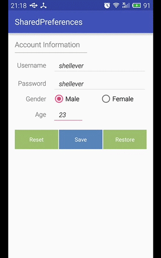

## SharedPreferences

`SharedPreferences`是Android中一个轻量级的数据存储类，适用于保存应用程序的配置参数。当使用SharedPreferences保存数据，内部会自动生成xml文件来存放真正的数据，而xml文件存放在`/data/data/<package name>/shared_prefs`目录下。

#### 获取应用程序中的SharedPreferences对象的两种方法

* `getSharedPreferences()` - 可以指定名称来确定多个不同的参数配置文件 (Context)

```java
// 指定名称为"account"的配置文件，模式为MODE_PRIVATE来获取当前程序的SharedPreferences对象，
// 若文件不存在时，则直接创建；若存在，则直接使用
SharedPreferences sp = getSharedPreferences("account", MODE_PRIVATE);    
```

* getPreferences() - 默认使用本地的Activity的类名来作为唯一的一个参数配置文件的名称 (Activity)

```java
// 默认使用本地的Activity类名作为参数配置文件的名称
SharedPreferences sp = getPreferences(MODE_PRIVATE);       
```

* Context中的文件创建模式mode

|mode|value|description|
|----|----|----|
|MODE_PRIVATE|0x0000|**默认模式**，创建的文件只能被应用程序本身访问，即为私有数据，以覆盖的方式写入数据|
|MODE_WORLD_READABLE|0x0001|创建的文件可以被其他应用程序进行读取，**已过时**|
|MODE_WORLD_WRITEABLE|0x0002|创建的文件可以被其他应用程序进行写入，**已过时**|
|MODE_APPEND|0x8000|首先检查文件是否存在，存在就往文件末尾追加内容，否则就创建新文件|

#### 写入数据

* 调用SharedPreferences的`edit()`方法来获取一个编辑器对象SharedPreferences.Editor
* 通过SharedPreferences.Editor的`putString()`/putBoolean()等方法来修改配置数据或添加新的配置数据
* 使用SharedPreferences.Editor的异步方法`apply()`来提交编辑器的数据更改，而`commit()`为同步方法

#### 获取数据

* 通过SharedPreferences的`getString()`/getBoolean()等方法获取数据

#### 清除数据

* 通过SharedPreferences.Editor的`remove()`方法可以移除指定的参数配置数据
* 通过SharedPreferences.Editor的`clear()`方法可以清除所有的参数配置数据

-----

#### SharedPreferences简单的使用

使用SharedPreferences来保存简单类型的数据，如字符串、整型、布尔型等数据，并借助Context的`getFilesDir().getParent()`方法来得到应用程序包名目录的路径，然后再以此拼接得到xml的完整路径：

```java
private String getSharedPrefsFileString(Context context, String name) {
    String path = context.getFilesDir().getParent();// 获取文件目录的父目录路径
    return path + "/shared_prefs/" + name + ".xml"; // SharedPreferences生成的xml数据文件
}
```

另一种获取SharedPreferences数据文件的方法是通过Context的`getDir()`方法来获取文件的父目录路径，但是查看方法的源码可知，getDir()方法会自动在目录名称加上`app_`前缀，即编程app_shared_prefs，所以需要手动去掉：

```java
private File getSharedPrefsFile(Context context, String name) {
    String dirPath = context.getDir("shared_prefs", Context.MODE_PRIVATE).getPath();
    // getDir()中会在目录名称前自动加上app_变成app_shared_prefs
    dirPath = dirPath.replace("app_", "");
    return new File(dirPath, name + ".xml");
}
```

* activity_main.xml

由于布局代码比较长，这里只贴出布局后的效果截图：


* MainActivity.java

首先是各个控件的初始化：

```java
private void initView() {
    mXMLTv = (TextView) findViewById(R.id.tv_xml);

    mUsernameEt = (EditText) findViewById(R.id.et_account_username);
    mPasswordEt = (EditText) findViewById(R.id.et_account_password);
    mAgeEt = (EditText) findViewById(R.id.et_account_age);
    mGenderRg = (RadioGroup) findViewById(R.id.rg_account_gender);
    mMaleGenderRb = (RadioButton) findViewById(R.id.rb_account_gender_male);
    mFemaleGenderRb = (RadioButton) findViewById(R.id.rb_account_gender_female);
    mResetBtn = (Button) findViewById(R.id.btn_reset);
    mSaveBtn = (Button) findViewById(R.id.btn_save);
    mRestoreBtn = (Button) findViewById(R.id.btn_restore);

    mGenderRg.setOnCheckedChangeListener(new RadioGroup.OnCheckedChangeListener() {
        @Override
        public void onCheckedChanged(RadioGroup group, int checkedId) {
            switch (checkedId) {
                case R.id.rb_account_gender_male:
                    gender = true;
                    break;
                case R.id.rb_account_gender_female:
                    gender = false;
                    break;
            }
        }
    });

    mResetBtn.setOnClickListener(this);
    mSaveBtn.setOnClickListener(this);
    mRestoreBtn.setOnClickListener(this);
}
```

按钮点击事件的处理：

```java
@Override
public void onClick(View v) {
    switch (v.getId()) {
        case R.id.btn_reset:
            reset();            // 复位各个控件
            Toast.makeText(this, "Reset Account Okay", Toast.LENGTH_SHORT).show();
            break;
        case R.id.btn_save:
            // 获取EditText控件上的文本并转成字符串，同时去掉首尾两端的空白符
            username = mUsernameEt.getText().toString().trim();
            if (TextUtils.isEmpty(username)) {      // return if null or ""
                Toast.makeText(this, "Username is empty.", Toast.LENGTH_SHORT).show();
                return;
            }

            password = mPasswordEt.getText().toString().trim();
            if (TextUtils.isEmpty(password)) {
                Toast.makeText(this, "Password is empty.", Toast.LENGTH_SHORT).show();
                return;
            }

            String ageString = mAgeEt.getText().toString().trim();
            if (TextUtils.isEmpty(ageString)) {
                Toast.makeText(this, "Age is empty.", Toast.LENGTH_SHORT).show();
                return;
            }
            age = Integer.valueOf(ageString);
            
            save();             // 读取并判断各个控件的数据，并保存到SharedPreferences中
            Toast.makeText(this, "Save Account Okay", Toast.LENGTH_SHORT).show();
            break;
        case R.id.btn_restore:
            restore();          // 读取保存在SharedPreferences中的数据，并依次显示在控件上
            Toast.makeText(this, "Restore Account Okay", Toast.LENGTH_SHORT).show();

            // 读取SharedPreferences保存数据而生成的xml文件内容并显示在TextView上
            testSharedPreferencesXML();
            break;
    }
}
```

控件复位处理函数：

```java
private void reset() {
    mUsernameEt.setText("");
    mPasswordEt.setText("");
    mMaleGenderRb.setChecked(false);
    mFemaleGenderRb.setChecked(true);
    mAgeEt.setText("");
    mXMLTv.setText("");
}
```

将从控件获取到的数据保存到SharedPreferences的处理函数：

```java
private boolean save() {
    sp = getSharedPreferences(PREFS_ACCOUNT, MODE_PRIVATE);
    SharedPreferences.Editor editor = sp.edit();        // 获取Editor对象
    editor.putString(KEY_ACCOUNT_USERNAME, username);   // 保存字符串数据
    editor.putString(KEY_ACCOUNT_PASSWORD, password);
    editor.putBoolean(KEY_ACCOUNT_GENDER, gender);      // 保存布尔数据
    editor.putInt(KEY_ACCOUNT_AGE, age);                // 保存整型数据
    editor.apply();             // 异步提交方法
    return true;
}
```

从SharedPreferences中获取数据并显示到各个控件上：

```java
private void restore() {
    sp = getSharedPreferences(PREFS_ACCOUNT, MODE_PRIVATE);
    username = sp.getString(KEY_ACCOUNT_USERNAME, "");  // 读取字符串数据，默认为""
    password = sp.getString(KEY_ACCOUNT_PASSWORD, "");
    gender = sp.getBoolean(KEY_ACCOUNT_GENDER, false);  // 读取布尔数据，默认为false
    age = sp.getInt(KEY_ACCOUNT_AGE, -1);               // 读取整型数据，默认为-1

    mUsernameEt.setText(username);
    mPasswordEt.setText(password);
    mMaleGenderRb.setChecked(gender);
    mFemaleGenderRb.setChecked(!gender);
    mAgeEt.setText(age < 0 ? "" : String.valueOf(age)); // 若小于0，则复位为""
}
```

读取SharedPreferences生成的xml数据文件：

```java
private void testSharedPreferencesXML() {
    // String file = getSharedPrefsFileString(this, PREFS_ACCOUNT);
    File file = getSharedPrefsFile(this, PREFS_ACCOUNT);
    String text = file.getPath();
    text += "\n\n";

    FileInputStream fis = null;
    ByteArrayOutputStream out = null;
    try {
        fis = new FileInputStream(file);        // 构建文件输入流
        out = new ByteArrayOutputStream();      // 构建字节数组输出流
        int len;                                // 记录每次读取数据的大小，-1表示结束
        byte[] buffer = new byte[10 * 1024];    // 定义10kB大小的缓冲区
        while ((len = fis.read(buffer)) != -1) {
            out.write(buffer, 0, len);
        }
        text += out.toString();
        mXMLTv.setText(text);                   // 将xml内容设置到TextView
    } catch (Exception e) {
        e.printStackTrace();
    } finally {
        try {
            if (out != null) {
                out.close();
            }
            if (fis != null) {
                fis.close();
            }
        } catch (IOException e) {
            e.printStackTrace();
        }
    }
}
```

* 效果演示


